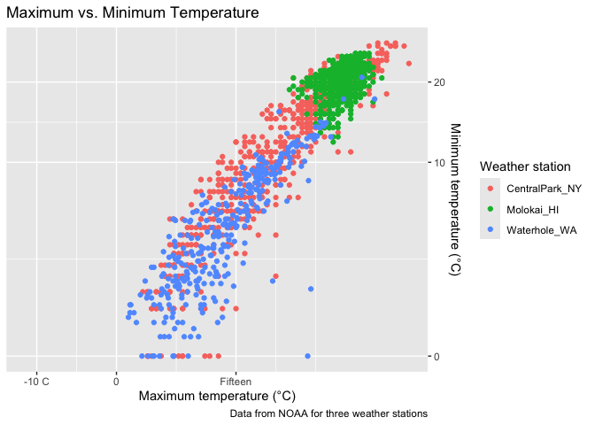
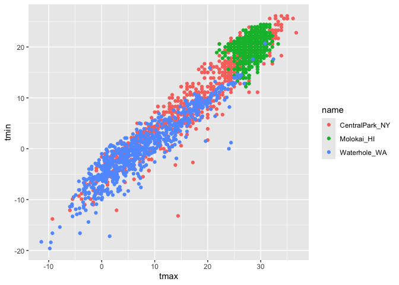
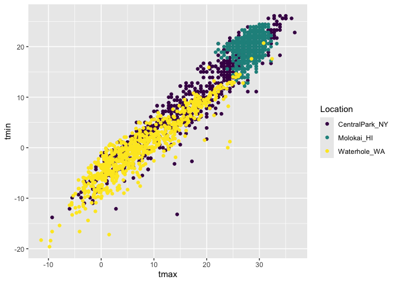
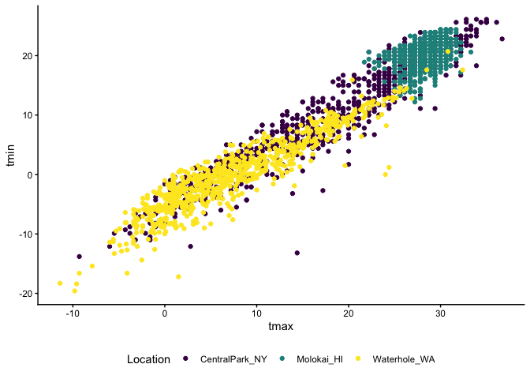
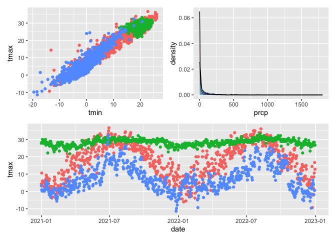

Visualization
================

``` r
library(tidyverse)
```

    ## ── Attaching core tidyverse packages ──────────────────────── tidyverse 2.0.0 ──
    ## ✔ dplyr     1.2.1     ✔ readr     2.2.0
    ## ✔ forcats   1.0.1     ✔ stringr   1.6.0
    ## ✔ ggplot2   4.0.2     ✔ tibble    3.3.1
    ## ✔ lubridate 1.9.5     ✔ tidyr     1.3.2
    ## ✔ purrr     1.2.1     
    ## ── Conflicts ────────────────────────────────────────── tidyverse_conflicts() ──
    ## ✖ dplyr::filter() masks stats::filter()
    ## ✖ dplyr::lag()    masks stats::lag()
    ## ℹ Use the conflicted package (<http://conflicted.r-lib.org/>) to force all conflicts to become errors

``` r
library(p8105.datasets)
data("weather_df")
```

Now we have everything we need!

Start with a scaterplot

``` r
weather_df |>
  ggplot(aes(x = tmax, y = tmin, color = name)) +
  geom_point() +
  labs(
    title = "Maximum vs. Minimum Temperature",
    x = "Maximum temperature (°C)",
    y = "Minimum temperature (°C)",
    color = "Weather station",
    caption = "Data from NOAA for three weather stations"
  ) +
scale_x_continuous(
  breaks = c(-10, 0, 15),
  labels = c("-10 C", "0", "Fifteen")
) +
  scale_y_continuous(
    trans = "sqrt", 
    position = "right"
  )
```

    ## Warning in transformation$transform(x): NaNs produced

    ## Warning in scale_y_continuous(trans = "sqrt", position = "right"): sqrt
    ## transformation introduced infinite values.

    ## Warning: Removed 520 rows containing missing values or values outside the scale range
    ## (`geom_point()`).

<!-- -->

Lets look at color!!

``` r
weather_df |>
  ggplot(aes(x = tmax, y = tmin, color = name)) + 
  geom_point() +
  scale_colour_hue()
```

    ## Warning: Removed 17 rows containing missing values or values outside the scale range
    ## (`geom_point()`).

<!-- -->

``` r
weather_df |>
  ggplot(aes(x = tmax, y = tmin, color = name)) + 
  geom_point() +
  viridis::scale_color_viridis(
    name = "Location",
    discrete = TRUE
  )
```

    ## Warning: Removed 17 rows containing missing values or values outside the scale range
    ## (`geom_point()`).

<!-- -->

## Themes

``` r
weather_df |>
  ggplot(aes(x = tmax, y = tmin, color = name)) +
  geom_point() +
  viridis::scale_color_viridis(
    name = "Location",
    discrete = TRUE
  ) +
  theme(legend.position = "bottom")
```

    ## Warning: Removed 17 rows containing missing values or values outside the scale range
    ## (`geom_point()`).

<!-- -->

``` r
weather_df |>
  ggplot(aes(x = tmax, y = tmin, color = name)) +
  geom_point() +
  viridis::scale_color_viridis(
    name = "Location",
    discrete = TRUE
  ) +
  theme_minimal() + 
  theme(legend.position = "bottom")
```

    ## Warning: Removed 17 rows containing missing values or values outside the scale range
    ## (`geom_point()`).

<!-- -->

``` r
weather_df |>
  ggplot(aes(x = tmax, y = tmin, color = name)) +
  geom_point() +
  viridis::scale_color_viridis(
    name = "Location",
    discrete = TRUE
  ) +
  theme_classic() + 
  theme(legend.position = "bottom")
```

    ## Warning: Removed 17 rows containing missing values or values outside the scale range
    ## (`geom_point()`).

<!-- -->

### Two more weird but useful plot things

``` r
central_park_df = 
    weather_df |> 
  filter(name == "CentralPark_NY")

molokai_df = 
    weather_df |> 
  filter(name == "Molokai_HI")

ggplot(molokai_df, aes(x = date, y = tmax, color = name)) + 
  geom_point() +
  geom_line(data = central_park_df)
```

    ## Warning: Removed 1 row containing missing values or values outside the scale range
    ## (`geom_point()`).

<!-- -->

multple panels with different plots

``` r
library(patchwork)

ggp_tmax_tmin =
  weather_df |>
  ggplot(aes(x = tmin, y = tmax, color = name)) +
  geom_point() +
  theme(legend.position = "none")

ggp_prcp_density =
  weather_df |>
  ggplot(aes(x = prcp, fill = name)) +
  geom_density(alpha = 0.5) +
  theme(legend.position = "none")

ggp_seasonal =
  weather_df |>
  ggplot(aes(x = date, y = tmax, color = name)) +
  geom_point() +
  theme(legend.position = "none")

(ggp_tmax_tmin + ggp_prcp_density) / ggp_seasonal
```

    ## Warning: Removed 17 rows containing missing values or values outside the scale range
    ## (`geom_point()`).

    ## Warning: Removed 15 rows containing non-finite outside the scale range
    ## (`stat_density()`).

    ## Warning: Removed 17 rows containing missing values or values outside the scale range
    ## (`geom_point()`).

<!-- -->
